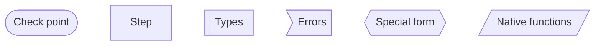
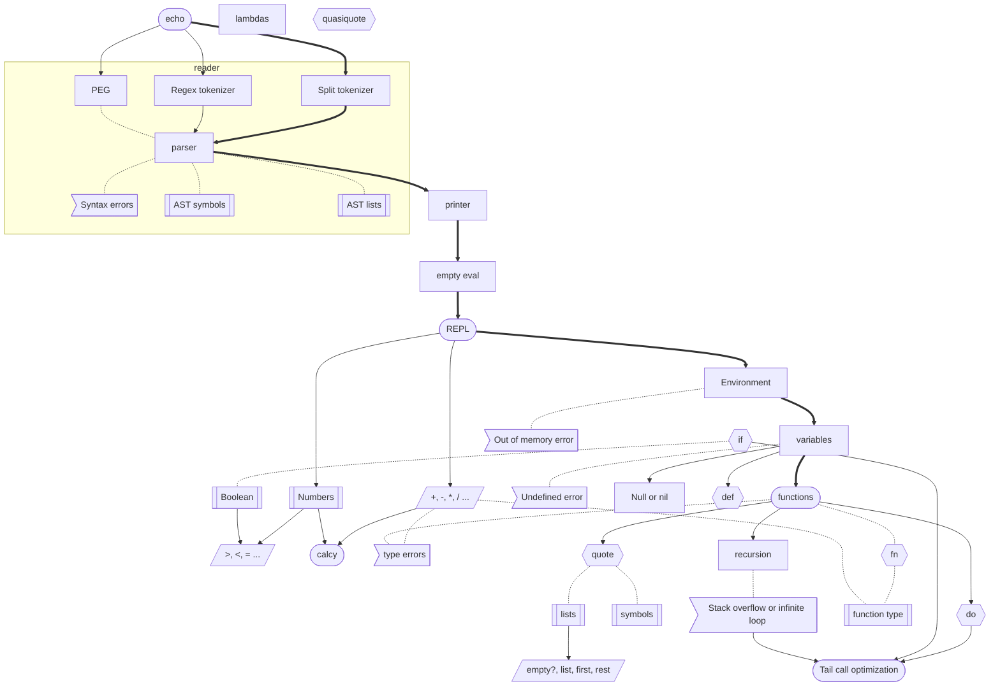

MAL implements idea of gamification. It has 10 levels followed one by one. Also it has optional steps, but it is not always clear what is optional.

What if instead of linear 10 steps there would be a 2d map (think of D&D map or Snake and Leader), where you can make choices and depending on your choices you can build different language with different tradeofs, for example: mutable vs immutable variables, static types vs dynamic types, compiled vs interpreted. Or for example show how some features are interchangable, for example `let` can be implemented as special form or as macro which uses function for binding.

To be continued...

Legend:

